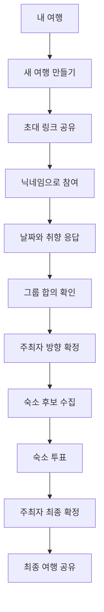

# TRIPTUNE

> 여럿의 날짜와 취향을 하나의 여행으로 조율하는 그룹 여행 합의 웹앱

친구들과 가능한 날짜와 여행 취향을 함께 입력하고, 그룹 합의 결과를 바탕으로 숙소 후보를 모아 투표한 뒤 최종 여행을 확정합니다.

회원가입을 먼저 요구하지 않습니다. 주최자와 참여자 모두 초대 링크와 닉네임으로 바로 시작하며, 원하는 경우 현재 게스트 계정을 Google 또는 이메일에 연결해 다른 기기에서도 여행을 이어서 관리할 수 있습니다.

## 핵심 경험

### 1. 로그인 없이 여행 시작

- 주최자는 여행 이름, 목적지, 후보 날짜 범위, 여행 기간과 예상 인원을 입력해 여행을 만듭니다.
- 참여자는 초대 링크에서 닉네임만 입력하면 바로 참여할 수 있습니다.
- Supabase Anonymous Auth 세션을 사용해 게스트의 여행과 응답을 구분합니다.
- 게스트 계정을 Google 또는 이메일에 연결해 기존 여행의 소유권을 유지한 채 계정에 저장할 수 있습니다.

### 2. 여러 달에 걸친 날짜와 취향 응답

- 후보 날짜 범위는 월 경계와 관계없이 최대 60일까지 설정할 수 있습니다.
- 실제 여행 기간과 후보 날짜 범위를 분리해, 연속된 여행 일정 후보를 계산합니다.
- 참여자는 가능 · 미정 · 불가 상태를 먼저 선택한 뒤 여러 날짜를 연속해서 입력할 수 있습니다.
- 자연 · 맛집 · 카페 · 활동 선호도를 -2부터 +2까지 입력합니다.
- 여행 속도, 소비 성향, 함께 다니는 정도와 최대 100자의 자유 의견을 함께 수집합니다.
- 자유 의견은 자동 점수에 포함하지 않고 그룹 합의 화면에서 별도로 보여줍니다.

### 3. 설명 가능한 그룹 합의

- 응답을 바탕으로 여행 기간에 맞는 연속 날짜 후보를 생성하고 우선순위를 계산합니다.
- 날짜별 가능 인원, 미정 인원, 불가 인원을 함께 표시합니다.
- 취향 평균뿐 아니라 긍정·부정 응답의 분포와 충돌 여부를 구분합니다.
- 계산 결과는 자동 확정이 아니라 주최자가 판단할 수 있는 근거로 사용합니다.
- 주최자가 날짜, 참여 인원과 여행 방향을 확정하면 숙소 단계가 열립니다.

### 4. 숙소 예약안 수집과 투표

- 참여자들이 숙소 링크, 위치, 이미지, 메모와 비용 정보를 후보로 등록합니다.
- 숙소 후보를 객실 하나가 아닌 하나의 **숙박 예약안**으로 다룹니다.
- 독채·객실 하나와 여러 객실 조합을 구분합니다.
- 여러 객실 조합은 객실명, 객실 수, 객실당 수용 인원과 가격을 입력해 총 객실 수·수용 인원·가격을 계산합니다.
- 총 수용 인원이 확정 인원보다 부족한 후보는 경고합니다.
- 숙소 링크의 메타데이터를 불러오되 서버에서 SSRF 방어 검사를 수행합니다.
- 후보 수집 → 투표 → 결과 → 최종 확정 상태에 따라 수정 가능한 행동을 제한합니다.

### 5. 역할과 단계 관리

- 주최자만 그룹 방향, 투표 시작, 숙소와 최종 여행을 확정할 수 있습니다.
- 투표가 끝난 뒤에는 주최자가 투표 단계로 돌아가거나, 기존 표를 지우고 후보 수집 단계로 되돌릴 수 있습니다.
- 주최자는 여행 전체를 삭제하고, 참여자는 본인의 응답과 후보를 정리한 뒤 여행에서 나갈 수 있습니다.
- 내 여행 화면에서 진행 중인 여행과 확정된 여행을 구분해 관리합니다.
- Supabase Realtime으로 다른 참여자의 응답과 단계 변경을 반영합니다.

## 사용자 흐름



## 기술 스택

### Frontend

- Next.js 16 (App Router)
- React 19
- TypeScript
- Tailwind CSS v4
- React Hook Form + Zod
- Lucide React

### Backend · Data

- Supabase Postgres
- Supabase Anonymous Auth
- Google OAuth · Email account linking
- Supabase Realtime
- Row Level Security
- PostgreSQL RPC

### Test

- Vitest — 날짜·취향 합의, 숙소 예약안 계산, 투표 집계, 입력 검증 단위 테스트
- Playwright — 주최자와 참여자를 분리한 세션으로 전체 사용자 흐름 E2E 테스트
- GitHub Actions — 타입 검사·린트·단위 테스트·빌드 자동 실행

## 주요 설계 판단

### 게스트 우선 인증

가입 절차 때문에 초대받은 사용자가 이탈하지 않도록 익명 로그인을 기본 진입 방식으로 선택했습니다. 계정 연결은 필수가 아니라 여행을 보존하고 다른 기기에서 이어보기 위한 선택 기능으로 제공합니다.

게스트 사용자가 Google 계정을 연결할 때는 새 사용자로 로그인하지 않고 현재 익명 사용자에 identity를 연결합니다. 이를 통해 이미 만든 여행과 응답이 새 계정에서 분리되는 문제를 방지합니다.

### 계산과 UI의 분리

날짜 후보, 취향 분류와 그룹 요약은 DB 행 구조에 직접 의존하지 않는 순수 함수로 작성했습니다. 계산 규칙을 UI와 분리해 테스트하기 쉽고, 결과 표현이 바뀌어도 합의 로직을 독립적으로 검증할 수 있습니다.

### 권한과 상태 전이

UI에서 버튼을 숨기는 것만으로 권한을 처리하지 않습니다. 참여자 본인의 응답 수정, 주최자 전용 확정과 단계 변경, 여행 삭제·나가기 규칙을 RLS와 RPC에서도 검증합니다.

투표가 시작되면 후보의 핵심 정보를 잠그고, 후보 수집 단계로 돌아갈 때는 기존 표를 삭제합니다. 변경된 후보에 이전 투표가 남는 문제를 막기 위한 규칙입니다.

### 숙소를 예약 구성안으로 모델링

다인원 여행에서는 독채 하나뿐 아니라 여러 객실을 함께 예약할 수 있습니다. 따라서 숙소 후보를 단일 객실이 아닌 예약 구성안으로 모델링하고, 세부 객실 JSON과 계산된 총 수용 인원·가격을 함께 저장합니다.

## 로컬 개발

### 1. 환경 변수

`.env.example`을 `.env.local`로 복사하고 Supabase 프로젝트 값을 입력합니다.

```bash
cp .env.example .env.local
```

```env
NEXT_PUBLIC_SUPABASE_URL=https://your-project.supabase.co
NEXT_PUBLIC_SUPABASE_ANON_KEY=sb_publishable_xxxxxxxxxxxxxxxxxxxxxxxx
```

- 값은 Supabase Dashboard의 **Project Settings → API**에서 확인합니다.
- anon 또는 publishable key는 클라이언트용 키이며 실제 접근 권한은 RLS가 통제합니다.
- service role key는 애플리케이션에서 사용하지 않습니다. E2E 테스트 데이터 정리에만 선택적으로 쓰이며, Node 쪽에서만 읽고 브라우저 번들에는 들어가지 않습니다.

### 2. Supabase 프로젝트 준비

1. [Supabase Dashboard](https://supabase.com/dashboard)에서 프로젝트를 생성합니다.
2. **SQL Editor**에서 아래 마이그레이션을 번호순으로 실행합니다.

| Migration | 내용 |
| --- | --- |
| `0001_init.sql` | 테이블, 타입, RLS, 트리거, 기본 RPC |
| `0002_fix_invite_token.sql` | 초대 토큰 생성 보완 |
| `0003_voting_completion.sql` | 선택 내용을 노출하지 않는 투표 완료자 조회 |
| `0004_delete_trip.sql` | 주최자 여행 삭제와 참여자 나가기 |
| `0005_flexible_dates_and_togetherness.sql` | 최대 60일 후보 범위, 함께 다니는 정도와 자유 의견 |
| `0006_stay_booking_plan.sql` | 독채·다객실 숙소 예약 구성안 |
| `0007_reopen_stay_stage.sql` | 투표 및 숙소 후보 수집 단계 다시 열기 |
| `0008_reopen_after_confirm.sql` | 최종 확정 이후 주최자가 필요한 단계만 다시 열기 |

3. **Authentication → Sign In / Providers**에서 Anonymous Sign-Ins를 활성화합니다.
4. Google 계정 연결을 사용할 경우 Google Provider와 Manual Linking을 활성화하고 OAuth redirect URL을 설정합니다.
5. 이메일 연결을 사용할 경우 이메일 확인 링크가 `/auth/callback`으로 돌아오도록 Site URL과 Redirect URLs를 설정합니다.
6. 필요하면 **Authentication → Rate Limits**에서 익명 로그인 제한을 예상 사용량에 맞게 조정합니다.

### 3. 실행

```bash
npm install
npm run dev
```

[http://localhost:3000](http://localhost:3000)에서 확인합니다.

## 테스트

| 명령어 | 하는 일 |
| --- | --- |
| `npm run test` | 기본 테스트 — 단위 테스트(Vitest) |
| `npm run test:unit` | 단위 테스트만 |
| `npm run test:e2e` | E2E(Playwright) headless 실행 |
| `npm run test:e2e:ui` | Playwright UI 모드 (단계별로 되감아 보기) |
| `npm run test:e2e:headed` | 실제 브라우저 창을 보면서 실행 |
| `npm run test:all` | 타입 검사 → 린트 → 단위 테스트 → 빌드 → E2E |
| `npm run typecheck` | `tsc --noEmit` |

### 단위 테스트

데이터베이스도 브라우저도 필요 없습니다. 순수 계산 로직만 검증합니다.

```bash
npm run test:unit
```

- `src/lib/trip/consensus.test.ts` — 날짜별 가능·미정·불가 집계, 연속 날짜 후보 계산,
  날짜별 충돌 인원, 취향 평균·충돌 판정, 한 줄 요약, **자유 입력(꼭 반영할 점)이 자동 점수에서 제외되는지**
- `src/lib/trip/stay.test.ts` — 전체/객실 예약안 계산(객실 수·총 수용 인원·총액·1인당),
  수용 인원 부족 판정, 동점 투표와 미투표자 처리
- `src/lib/trip/format.test.ts` · `calendar.test.ts` — 금액·기간 표기, 달력 격자
- `src/lib/validation/trip.test.ts` · `accommodation.test.ts` — 후보 기간 60일 상한, 예약안 입력 규칙
- `src/lib/trip/reopen.test.ts` — 조율 재개 배너·라벨
- `src/lib/server/link-preview.test.ts` — og 태그 파싱

### E2E 테스트

핵심 사용자 흐름 전체를 주최자·참여자 A·참여자 B 세 개의 독립 브라우저 세션으로 검증합니다.

| 파일 | 검증하는 흐름 |
| --- | --- |
| `e2e/scenario-a-consensus.spec.ts` | 여행 생성 → 초대 → 세 사람 응답 → 저장 후 그룹 합의 자동 이동 → 임시 합의 표시 → Realtime 갱신 → 주최자 확정 |
| `e2e/scenario-b-stay.spec.ts` | 숙소 전체/객실 예약안 등록과 계산, 수용 인원 부족 차단, 투표와 Realtime 결과 공개, 참여자 권한, 최종 확정 |
| `e2e/scenario-c-reopen.spec.ts` | 확정 이후 `숙소 투표만` / `날짜·취향부터` 재개, 데이터 보존, 다른 브라우저 실시간 반영 |
| `e2e/scenario-d-errors.spec.ts` | 잘못된 초대 링크, 없는 여행, 닉네임 중복, 저장 실패, 주최자 전용 RPC 직접 호출, 나가기·삭제, 새로고침·뒤로가기 |

#### 1. 테스트용 Supabase 준비

**운영 Supabase 는 자동 테스트 대상으로 쓸 수 없습니다.** 설정이 운영 주소를 가리키면
테스트가 시작 전에 멈춥니다. 아래 중 하나를 준비하세요.

**① 로컬 Supabase (권장)** — Docker 필요

```bash
npm i -D supabase
npx supabase init          # 이미 supabase/ 가 있으면 건너뜀
npx supabase start         # API URL 과 anon/service_role key 를 출력합니다
# 출력된 API URL 로 마이그레이션을 순서대로 실행
npx supabase db reset      # supabase/migrations/*.sql 을 번호 순으로 적용
```

**② 테스트 전용 Supabase 프로젝트** — 운영과 별개로 새 프로젝트를 만들고,
`supabase/migrations/` 의 SQL 을 번호 순으로 SQL Editor 에서 실행한 뒤
**Authentication → Sign In / Providers → Anonymous Sign-Ins** 를 켭니다.
이 경우 `E2E_ALLOW_REMOTE_SUPABASE=1` 을 함께 설정해야 합니다.

#### 2. 환경 변수

`.env.example` 의 `E2E_*` 항목을 보고 저장소 루트에 `.env.test` 를 만듭니다
(`.env.test` 는 `.gitignore` 에 걸려 커밋되지 않습니다).

```bash
E2E_SUPABASE_URL=http://127.0.0.1:54321
E2E_SUPABASE_ANON_KEY=...
# 정리용(선택). Node 쪽에서만 쓰이고 브라우저·리포트에는 절대 나가지 않습니다.
E2E_SUPABASE_SERVICE_ROLE_KEY=...
```

필수 변수가 없으면 런타임 오류 대신 **빠진 변수 이름과 설정 방법**을 출력하고 중단합니다.

#### 3. 실행

```bash
npx playwright install chromium   # 최초 1회
npm run test:e2e
```

앱은 테스트가 직접 프로덕션 빌드해서 `http://127.0.0.1:3100` 에 띄웁니다
(`next dev` 의 첫 진입 컴파일 지연 때문에 테스트가 흔들리는 것을 막기 위해서입니다).
개발 서버 포트(3000)와 겹치지 않으므로 `npm run dev` 를 켜둔 채로도 돌릴 수 있습니다.

#### 4. 테스트 데이터

- 이 실행이 만든 여행에는 `[E2E-<실행ID>] 제주도` 처럼 **실행마다 다른 접두사**가 붙습니다.
- 끝나면 그 접두사로 시작하는 여행만 지웁니다 (`e2e/support/cleanup.ts`).
  테이블을 비우거나 접두사 없는 데이터를 건드리는 코드는 없습니다.
- `E2E_SUPABASE_SERVICE_ROLE_KEY` 가 없으면 정리를 건너뛰고, 남은 접두사를 콘솔에 알려줍니다.
- 각 테스트는 스스로 필요한 상태를 만들며 실행 순서에 의존하지 않습니다.

#### 5. 실패했을 때

```
playwright-report/     # npx playwright show-report
test-results/          # 실패한 테스트의 screenshot · video · trace.zip
npx playwright show-trace test-results/<...>/trace.zip
```

trace 는 실패한 테스트에서만, video 와 screenshot 도 실패 시에만 남습니다.

### GitHub Actions

`.github/workflows/ci.yml` 이 push 와 pull request 마다 돕니다.

1. 의존성 설치 → 2. 타입 검사 → 3. 린트 → 4. 단위 테스트 → 5. 프로덕션 빌드
   (여기까지는 Supabase 없이 언제나 실행됩니다)
6. Playwright 브라우저 설치 → 7. 핵심 E2E → 8. 실패 시 리포트·trace 업로드
   (**아래 시크릿이 등록된 저장소에서만** 실행되고, 없으면 조용히 건너뜁니다)

필요한 GitHub Secrets (Settings → Secrets and variables → Actions):

| Secret | 필수 | 설명 |
| --- | --- | --- |
| `E2E_SUPABASE_URL` | ✅ | 테스트 전용 Supabase 주소. **운영 주소를 넣지 마세요.** |
| `E2E_SUPABASE_ANON_KEY` | ✅ | 테스트용 anon(publishable) 키 |
| `E2E_ALLOW_REMOTE_SUPABASE` | 원격 사용 시 | 값 `1`. 로컬이 아닌 테스트 프로젝트를 쓴다는 명시적 확인 |
| `E2E_SUPABASE_SERVICE_ROLE_KEY` | 선택 | 실행 후 테스트 데이터 정리용 |

### SQL 테스트

`reopen_after_confirm` 등 서버 함수의 권한·상태 전이는 Postgres 를 직접 띄워 검증합니다.

```bash
supabase/tests/run.sh     # PGPORT 환경변수로 접속 포트 지정
```

## Vercel 배포

1. GitHub 저장소를 Vercel에 Import합니다.
2. Environment Variables에 아래 값을 Production과 Preview 환경에 추가합니다.
   - `NEXT_PUBLIC_SUPABASE_URL`
   - `NEXT_PUBLIC_SUPABASE_ANON_KEY`
3. Supabase Authentication의 Site URL과 Redirect URLs에 Vercel 배포 주소를 등록합니다.
4. 배포 후 익명 여행 생성, 초대 링크 참여, Google·이메일 계정 연결과 Realtime 반영을 확인합니다.

### 배포 전 체크리스트

- [ ] 마이그레이션 0001~0008을 번호순으로 실행했는가
- [ ] Anonymous Sign-Ins가 활성화되어 있는가
- [ ] Google을 사용할 경우 Provider와 Manual Linking을 설정했는가
- [ ] Site URL과 Redirect URLs가 로컬·배포 주소를 포함하는가
- [ ] 익명 로그인 Rate Limit이 예상 트래픽에 맞는가
- [ ] `npm run typecheck`, `npm run lint`, `npm run test`, `npm run build`가 성공하는가
- [ ] 게스트 생성 → 초대 참여 → 합의 → 숙소 투표 → 최종 확정 흐름이 동작하는가

## 프로젝트 구조

```text
src/
├─ app/
│  ├─ page.tsx                         내 여행
│  ├─ new/page.tsx                     새 여행 만들기
│  ├─ join/[inviteToken]/              초대 링크 참여
│  ├─ auth/callback/                   Google·이메일 계정 연결 콜백
│  ├─ trip/[tripId]/
│  │  ├─ (tabs)/                       홈 · 합의 · 숙소 탭
│  │  └─ respond/                      날짜·취향 입력
│  └─ api/link-preview/                숙소 링크 메타데이터 조회
├─ components/
│  ├─ auth/                            게스트·계정 연결 UI
│  ├─ layout/                          반응형 앱바·탭바·내비게이션
│  ├─ trip/                            여행 도메인 UI
│  └─ ui/                              범용 UI 컴포넌트
└─ lib/
   ├─ server/ssrf-guard.ts             링크 미리보기 SSRF 방어
   ├─ supabase/                        browser·server 클라이언트와 DB 타입
   ├─ trip/                             합의 계산과 여행 데이터 로직
   └─ validation/                       여행·숙소 입력 검증

supabase/
├─ migrations/                          SQL 스키마와 RPC 변경 이력
└─ tests/                               서버 함수 권한·상태 전이 SQL 테스트
e2e/
├─ scenario-*.spec.ts                   핵심 사용자 흐름 E2E
├─ support/                             액터·플로우·환경변수·데이터 정리 유틸
└─ global-setup / global-teardown       환경 검증과 실행별 데이터 정리
.github/workflows/ci.yml                타입·린트·단위·빌드 (+조건부 E2E)
```

## 현재 범위

TRIPTUNE은 여행 예약 서비스가 아니라 **그룹의 조건과 취향을 수집하고, 충돌을 확인해 함께 결정하는 과정**에 집중합니다.

결제, 실제 숙소 예약, 객실별 인원 배정, 경비 정산과 실시간 채팅은 현재 MVP 범위에 포함하지 않습니다.
